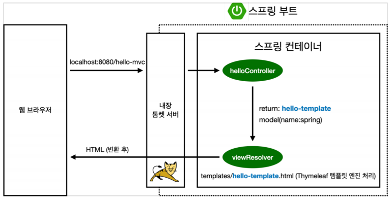

# spring
study

## Table of Contents

- [About The Project](#About-The-Project)
- [라이브러리 살펴보기](#라이브러리-살펴보기)
- [View 환경설정](#View-환경설정)
- [스프링 웹 개발 기초](#스프링-웹-개발-기초)


## About The Project

## 라이브러리 살펴보기
Gradle은 의존관계가 있는 라이브러리를 함께 다운로드 한다.

* 스프링 부트 라이브러리
  - spring-boot-starter-web
    + spring-boot-starter-tomcat : 톰켓 (웹서버)
    + spring-webmvc : 스프링 웹 MVC
  - spring-boot-starter-thymeleaf:타임리프 템플릿 엔진(View)
  - spring-boot-starter(공통): 스프링부트 + 스프링코어 + 로깅
    + spring-boot
      + spring-core
    + spring-boot-starter-logging
      + logback, slf4j
  
* 테스트 라이브러리
  - spring-boot-starter-test
    + junit : 테스트 프레임워크 
    + mockito : 목 라이브러리
    + assertj : 테스트 코드를 좀 더 편한게 작성하게 도와주는 라이브러리
    + spring-test : 스프링 통합 테스트 지원
  
## View 환경설정
* Welcome Page 만들기
  - resource/static/index.html
  - static : 정적파일
  ```html
  <!DOCTYPE HTML>
  <html>
  <head>
    <title>Hello</title>
    <meta http-equiv="Content-Type" content="text/html; charset=UTF-8" />
  </head>
  <body>
   Hello
  <a href="/hello">hello</a>
  </body>
  </html>
  ```
  
  - 스프링 부트가 제공하는 Welcome Page 기능
    + static/index.html 을 올려두면 Welcome page 기능을 제공한다
    + https://docs.spring.io/spring-boot/docs/2.3.1.RELEASE/reference/html/spring-boot-features.html#boot-features-spring-mvc-welcome-page
    
  - thymeleaf 템플릿 엔진
    + thymeleaf 공식 사이트: https://www.thymeleaf.org/
    + 스프링 공식 튜토리얼: https://spring.io/guides/gs/serving-web-content/
    + 스프링부트 메뉴얼: https://docs.spring.io/spring-boot/docs/2.3.1.RELEASE/reference/html/spring-boot-features.html#boot-features-spring-mvc-template-engines
  
  ```java
  @Controller
  public class HelloController {
  
    @GetMapping("hello")
    public String hello(Model model) {
        model.addAttribute("data", "hello!!");
        return "hello";
    }
  }
  ```
  - resources/templates/hello.html
  ```html
  <!DOCTYPE HTML>
  <html xmlns:th="http://www.thymeleaf.ofg">
  <head>
      <title>Hello</title>
      <meta http-equiv="Content-Type" content="text/html; charset=UTF-8"/>
  </head>
  
  <body>
  <p th:text="'안녕하세요. ' + ${data}">안녕하세요. 손님</p>
  </body>
  </html>
  ```
  
  - thymeleaf 템플릿엔진 동작 확인
    + 실행 : http://localhost:8080/hello
    + **동작환경 그림**
      
    
    + 컨트롤러에서 리턴 값으로 문자를 반환하면 viewResolver가 화면을 찾아서 처리한다.
      + 스프링 부트 템플릿 엔진 기본 viewName 매핑
      + resource:templates/ + {ViewName} + .html
  > 참고 spring-boot-devtools 라이브러리를 추가하면, html 파일을 컴파일만 해주면 서버 재시작 없이 View 파일 변경이 가능하다.
  
* 빌드하고 실행하기
  - 콘솔로 이동
    + gradlew.bat 실행
    + 명령 프롬프트에서 gradlew 하고 하고 엔터침
    + gradlew build
    + 폴더 목록 확인 dir
  
## 스프링 웹 개발 기초

### 정적 컨텐츠

* 스프링 부트 정적 컨텐츠 기능
* https://docs.spring.io/spring-boot/docs/2.3.1.RELEASE/reference/html/spring-boot-features.html#boot-features-spring-mvc-static-content

> resource/static/hello-static.html
```html
<!DOCTYPE HTML>
<html>
<head>
    <title>static content</title>
    <meta http-equiv="Content-Type" content="text/html; charset=UTF-8"/>
</head>

<body>
정적 컨텐츠 입니다.
</body>
</html>
```
* 실행
  - http://localhost:8080/hello-static.html
  
* 정적 컨텐츠 이미지
  
  
## MVC와 템플릿 엔진

* MVC : Model, View, Controller

  - **Controller**
  ```java
  @Controller
  public class HelloController {
    @GetMapping("hello-mvc")
    public String helloMvc(@RequestParam("name") String name, Model model) {
        model.addAttribute("name", name);
        return "hello-template";
    }
  }
  ```
  - **View**
  > resources/template/hello-template.html
  ```html
  <html xmlns:th="http://www.thymeleaf.org">
  <body>
  <p th:text="'hello ' + ${name}">hello! empty</p>
  </body>
  </html>
  ```
  - **실행**
    + http://localhost:8080/hello-mvc?name=spring
    
  - **MVC,템플릿 엔진 이미지**
    
  
## API
* **ResponsBody 문자반환**
  ```java
  @Controller
  public class HelloController {
    @GetMapping("hello-string")
    @ResponseBody
    public String helloString(@RequestParam("name") String name) {
        return "hello " + name;
    }
  }
  ```
  - @ResponseBody를 사용하면 뷰 리졸버(ViewResolver)를 사용하지 않음
  - 대신에 HTTP의 BODY에 문자 내용을 직접 반환(HTML BODY TAG를 말하는 것이 아님)
  
* 실행
  - http://localhost:8080/hello-spring?name=spring
  
* @ResponseBody 객체 반환
  ```java
  @Controller
  public class HelloController {
    @GetMapping("hello-api")
    @ResponseBody
    public Hello helloApi(@RequestParam("name") String name) {
        Hello hello = new Hello();
        hello.setName(name);
        return hello;
    }
    static class Hello {
        private String name;
        public String getName() {
            return name;
        }
        public void setName(String name) {
            this.name = name;
        }
    }
  }
  ```
  - @ResponseBody를 사용하고, 객체를 반환하면 객체가 JSON으로 변환됨
  
* 실행
  - http://localhost:8080/hello-api?name=spring
  
* **ResponseBody 사용 원리**
  
  
  - @ResponsBody를 사용
    + HTTP의 BODY 문자 내용을 직접 반환
    + viewResolver 대신에 HttpMessageConverter가 동작
    + 기본 문자처리 : StringHttpMessageConverter
    + 기본 객체처리 : MappingJackson2HttpMessageConverter
    + byte 처리 등등 기타 여러 HttpMessageConverter가 기본으로 등록되어 있음
  
  > 참고 : 클라이언트의 HTTp Accept헤더와 서버의 컨트롤러 반환 타입 정보 둘을 조합해서
  HttpMessageConverter가 선택된다.
  
##
  