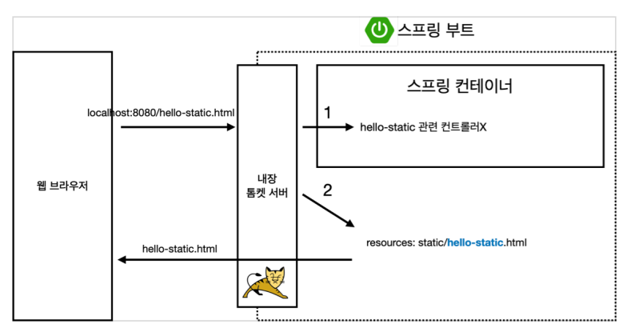
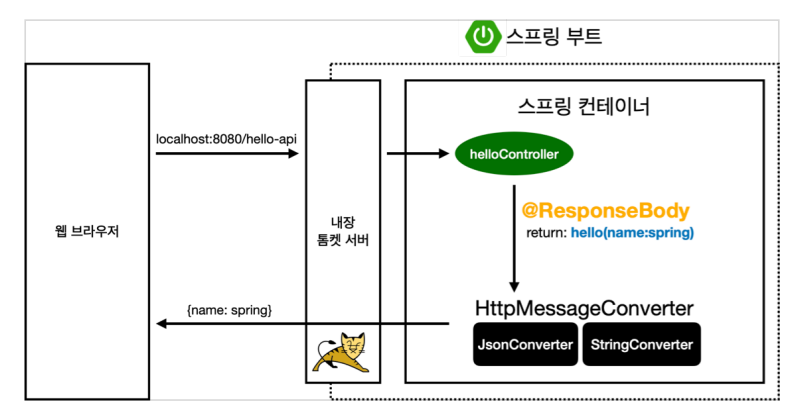
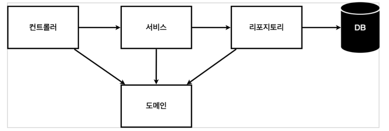
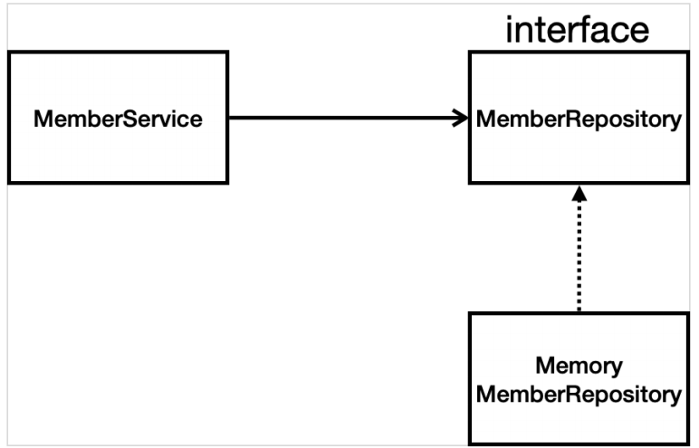
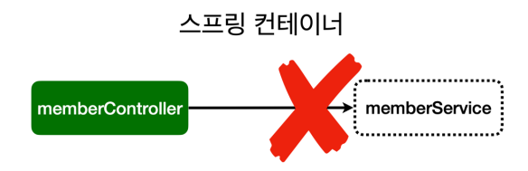
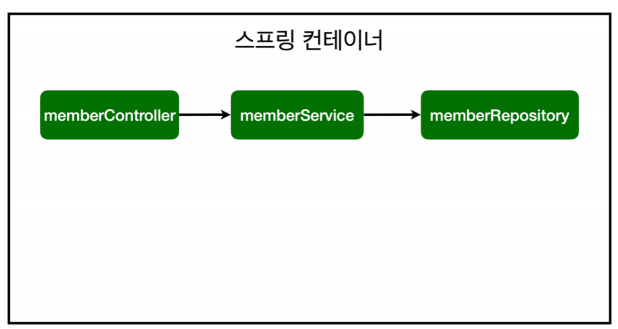

# spring
study

## Table of Contents

- [About The Project](#About-The-Project)
- [라이브러리 살펴보기](#라이브러리-살펴보기)
- [View 환경설정](#View-환경설정)
- [스프링 웹 개발 기초](#스프링-웹-개발-기초)
- [정적 컨텐츠](#정적-컨텐츠)
- [MVC와 템플릿 엔진](#MVC와-템플릿-엔진)
- [API](#API)
- [비즈니스 요구사항 정리](#비즈니스-요구사항-정리)
- [회원 도메인과 리포지토리 만들기](#회원-도메인과-리포지토리-만들기)
- [회원 리포지토리 테스트 케이스 작성](회원-리포지토리-테스트-케이스-작성)
- [용어정리](#용어정리)
- [ShortCut](#ShortCut)

## About The Project

## 라이브러리 살펴보기
Gradle 의존관계가 있는 라이브러리를 함께 다운로드 한다.

* 스프링 부트 라이브러리
  - spring-boot-starter-web
    + spring-boot-starter-tomcat : 톰켓 (웹서버)
    + spring-webmvc : 스프링 웹 MVC
  - spring-boot-starter-thymeleaf:타임리프 템플릿 엔진(View)
  - spring-boot-starter(공통): 스프링부트 + 스프링코어 + 로깅
    + spring-boot
      + spring-core
    + spring-boot-starter-logging
      + logback, slf4j


* 테스트 라이브러리
  - spring-boot-starter-test
    + junit : 테스트 프레임워크
    + mockito : 목 라이브러리
    + assertj : 테스트 코드를 좀 더 편한게 작성하게 도와주는 라이브러리
    + spring-test : 스프링 통합 테스트 지원

## View 환경설정
* Welcome, Page 만들기
  - resource/static/index.html
  - static : 정적파일
  ```html
  <!DOCTYPE HTML>
  <html>
  <head>
    <title>Hello</title>
    <meta http-equiv="Content-Type" content="text/html; charset=UTF-8" />
  </head>
  <body>
   Hello
  <a href="/hello">hello</a>
  </body>
  </html>
  ```

  - 스프링 부트가 제공하는 Welcome Page 기능
    + static/index.html 을 올려두면 Welcome page 기능을 제공한다
    + https://docs.spring.io/spring-boot/docs/2.3.1.RELEASE/reference/html/spring-boot-features.html#boot-features-spring-mvc-welcome-page

  - thymeleaf 템플릿 엔진
    + thymeleaf 공식 사이트: https://www.thymeleaf.org/
    + 스프링 공식 튜토리얼: https://spring.io/guides/gs/serving-web-content/
    + 스프링부트 메뉴얼: https://docs.spring.io/spring-boot/docs/2.3.1.RELEASE/reference/html/spring-boot-features.html#boot-features-spring-mvc-template-engines

  ```java
  @Controller
  public class HelloController {
  
    @GetMapping("hello")
    public String hello(Model model) {
        model.addAttribute("data", "hello!!");
        return "hello";
    }
  }
  ```
  - resources/templates/hello.html
  ```html
  <!DOCTYPE HTML>
  <html xmlns:th="http://www.thymeleaf.ofg">
  <head>
      <title>Hello</title>
      <meta http-equiv="Content-Type" content="text/html; charset=UTF-8"/>
  </head>
  
  <body>
  <p th:text="'안녕하세요. ' + ${data}">안녕하세요. 손님</p>
  </body>
  </html>
  ```

  - thymeleaf 템플릿엔진 동작 확인
    + 실행 : http://localhost:8080/hello
    + **동작환경 그림**
      

    + 컨트롤러에서 리턴 값으로 문자를 반환하면 viewResolver가 화면을 찾아서 처리한다.
      + 스프링 부트 템플릿 엔진 기본 viewName 매핑
      + resource:templates/ + {ViewName} + .html
  > 참고 spring-boot-devtools 라이브러리를 추가하면, html 파일을 컴파일만 해주면 서버 재시작 없이 View 파일 변경이 가능하다.

* 빌드하고 실행하기
  - 콘솔로 이동
    + gradlew.bat 실행
    + 명령 프롬프트에서 gradlew 하고 하고 엔터침
    + gradlew build
    + 폴더 목록 확인 dir

## 스프링 웹 개발 기초

### 정적 컨텐츠

* 스프링 부트 정적 컨텐츠 기능
* https://docs.spring.io/spring-boot/docs/2.3.1.RELEASE/reference/html/spring-boot-features.html#boot-features-spring-mvc-static-content

> resource/static/hello-static.html
```html
<!DOCTYPE HTML>
<html>
<head>
    <title>static content</title>
    <meta http-equiv="Content-Type" content="text/html; charset=UTF-8"/>
</head>

<body>
정적 컨텐츠 입니다.
</body>
</html>
```
* 실행
  - http://localhost:8080/hello-static.html

* 정적 컨텐츠 이미지
  

## MVC와 템플릿 엔진

* MVC : Model, View, Controller

  - **Controller**
  ```java
  @Controller
  public class HelloController {
    @GetMapping("hello-mvc")
    public String helloMvc(@RequestParam("name") String name, Model model) {
        model.addAttribute("name", name);
        return "hello-template";
    }
  }
  ```
  - **View**
  > resources/template/hello-template.html
  ```html
  <html xmlns:th="http://www.thymeleaf.org">
  <body>
  <p th:text="'hello ' + ${name}">hello! empty</p>
  </body>
  </html>
  ```
  - **실행**
    + http://localhost:8080/hello-mvc?name=spring

  - **MVC,템플릿 엔진 이미지**
    

## API
* **ResponsBody 문자반환**
  ```java
  @Controller
  public class HelloController {
    @GetMapping("hello-string")
    @ResponseBody
    public String helloString(@RequestParam("name") String name) {
        return "hello " + name;
    }
  }
  ```
  - @ResponseBody를 사용하면 뷰 리졸버(ViewResolver)를 사용하지 않음
  - 대신에 HTTP의 BODY에 문자 내용을 직접 반환(HTML BODY TAG를 말하는 것이 아님)

* 실행
  - http://localhost:8080/hello-spring?name=spring

* @ResponseBody 객체 반환
  ```java
  @Controller
  public class HelloController {
    @GetMapping("hello-api")
    @ResponseBody
    public Hello helloApi(@RequestParam("name") String name) {
        Hello hello = new Hello();
        hello.setName(name);
        return hello;
    }
    static class Hello {
        private String name;
        public String getName() {
            return name;
        }
        public void setName(String name) {
            this.name = name;
        }
    }
  }
  ```
  - @ResponseBody를 사용하고, 객체를 반환하면 객체가 JSON으로 변환됨

* 실행
  - http://localhost:8080/hello-api?name=spring

* **ResponseBody 사용 원리**
  

  - @ResponsBody를 사용
    + HTTP의 BODY 문자 내용을 직접 반환
    + viewResolver 대신에 HttpMessageConverter가 동작
    + 기본 문자처리 : StringHttpMessageConverter
    + 기본 객체처리 : MappingJackson2HttpMessageConverter
    + byte 처리 등등 기타 여러 HttpMessageConverter가 기본으로 등록되어 있음

  > 참고 : 클라이언트의 HTTp Accept헤더와 서버의 컨트롤러 반환 타입 정보 둘을 조합해서
  HttpMessageConverter가 선택된다.

## 비즈니스 요구사항 정리
* 데이터 : 회원ID, 이름
* 기능 : 회원 등록, 조회
* 아직 데이터 저장소가 선정되지 않음 ( 가상의 시나리오 )


**일반적인 웹 애플리케이션 계층 구조**



- 컨트롤러 : 웹 MVC의 컨트롤러 역할
- 서비스 : 핵심 비즈니스 로직 구현
- 리포지토리 : 데이터베이스에 접근, 도메인 객체를 DB에 저장하고 관리
- 도메인 : 비즈니스 도메인 객체, 예) 회원,주문,쿠폰 등등 주로 데이터베이스에 저장하고 관리됨

**클래스 의존관계**



- 아직 데이터 저장소가 선정되지 않아서, 우선 인터페이스로 구현 클래스를 변경할 수 있도록 설계
- 데이터 저장소는 RDB, NoSQL 등등 다양한 저장소를 고민중인 상황으로 가정
- 개발을 진행하기 위해서 초기 개발 단계에서는 구현체로 가벼운 메모리 기반의 데이터 저장소 사용

## 회원 도메인과 리포지토리 만들기
**회원객체**
  ```java
  public class Member {
  String name;
  long id;

  public String getName() {
    return name;
  }

  public void setName(String name) {
    this.name = name;
  }

  public long getId() {
    return id;
  }

  public void setId(long id) {
    this.id = id;
  }
}
  ```

**회원 리포지토리 인터페이스**
  ```java
public interface MemberRepository {
    Member save(Member member);
    // Optional
    Optional<Member> findById(Long id);
    Optional<Member> findByName(String name);
    List<Member> findAll();
}
  ```
* Optional Class
  - Method Return (null || x) : Exception
  - 예외 방지용으로 사용할 수 있으며 Null 처리등을 할 수 있음.

* Interface
  - 하위클래스에서 특정 메서드만 사용하도록 강제
  - 클래스들간의 의존성 감소(decoupling)

**회원 리포지토리 메모리 구현체**

  ```java
  public class MemoryMemberRepository implements MemberRepository {


  private static Map<Long, Member> store = new HashMap<>();
  private static long sequence = 0L;


  @Override
  public Member save(Member member) {
    member.setId(++sequence);
    store.put(member.getId(), member);
    return member;
  }

  @Override
  public Optional<Member> findById(Long id) {
    return Optional.ofNullable(store.get(id)); // NUll 이여도 반환됨 Client 에서 처리
  }

  @Override
  public Optional<Member> findByName(String name) {
    return store.values().stream()
            .filter(member -> member.getName().equals(name))
            .findAny();
  }

  @Override
  public List<Member> findAll() {
    return new ArrayList<>(store.values());
  }

  public void clearStore(){
    store.clear();
  }
}
  ```
* 인터페이스 클래스
  - save
  - findById
  - findByName
  - findAll
  - 위 4개의 메소드를 구현하는 클래스

* Map 사용
  - 데이터와 데이터에 해당되는 이름(Key) 쌍으로 저장된다.(Key/Value 쌍)
  - Key 이용해서 Value 얻는다. (검색속도가 빠름)

* Optional.ofNullable
  - Null 이여도 반환되며 -> Client 에서 처리하는 식으로 넘기는 형태

* lambda 사용
  - 객체가 아닌 기능적인 코드에 집중하자.
  - 간결한 표현식
  - 하나의 메서드를 가진 인터페이스 사용시 일반적으로 람다식이 사용된다.

* Stream
  - Collection 저장된 데이터를 중간처리 최종처리를 할 수 있다.
    + 중간처리
      + 중복제거, 정렬 ==> Map
    + 최종처리
      + Sum, Max, Min, Count ==> Reduce

## 회원 리포지토리 테스트 케이스 작성

* 테스트 방법
  - main method 통해 실행
  - 웹 애플리케이션의 컨트롤러를 통해서 해당 기능을 실행
    + 위 두가지 방법은 준비하고 실행하는데 오래 걸리고, 반복 실행하기 어렵고 여러 테스트를 한번에 실행하기 어렵다는 단점이 존재
  - Junit 프레임 워크 테스트


**회원 리포지토리 메모리 구현체 테스트**

**src/test/java** 하위 폴더에 생성한다.

```java
/**
 * 순서는 보장이 되지 않는다.
 * @AfterEach : 테스트 끝나자마자 실행되어 클리어 해줌
 * TDD : 테스트를 먼저 만들고 구현 클래스를 만들어서 실행
 */
class MemoryMemberRepositoryTest {

    MemoryMemberRepository repository = new MemoryMemberRepository();

    @AfterEach
    public void afterEach(){
        repository.clearStore();
    }


    @Test
    public void save(){
        Member member = new Member();
        member.setName("spring");

        repository.save(member);
        Member result = repository.findById(member.getId()).get();
        assertThat(member).isEqualTo(result);

        //Assertions.assertEquals(member, null);
    }

    @Test
    public void findByName(){
        Member member1 = new Member();
        member1.setName("spring1");
        repository.save(member1);

        Member member2 = new Member();
        member2.setName("spring2");
        repository.save(member2);

        Member result = repository.findByName("spring1").get();
        assertThat(result).isEqualTo(member1);
    }
    @Test
    public void findAll(){
        Member member1 = new Member();
        member1.setName("spring1");
        repository.save(member1);

        Member member2 = new Member();
        member2.setName("spring2");
        repository.save(member2);

        List<Member> result = repository.findAll();
        assertThat(result.size()).isEqualTo(2);

    }
}
```


- @AfterEach
  + 각 테스트 메서드가 종료되자마자 실행되는 메서드 (객체 클리어 용으로 사용)
  + 테스트 방식은 순서가 보장되지 않기 때문에 사용됨
  + 한번에 여러 테스트 진행시 메모리 DB에 직전 테스트의 결과가 남을 수 있다.
  + 이렇게 되면 다음 이전 테스트 때문에 다음 테스트 실패 가능성 높다
  + 테스트는 각각 독립적으로 실행되어야 한다. 의존관계가 있는 것은 좋은 테스트가 아니다.


- AssertThat
  + Junit 4.4부터 assertThat 메서드가 추가
  + 객체 비교 테스트


- Assertions.assertThar(기대값).isEqualTo(비교값)
  + static import 처리가능


- Save method
  + Member 객체 생성
  + name 지정
  + repository member 저장
  + repository member Id 존재유무 검색
  + assertThat 사용하여 member / result(기대값)  테스트


- findByName()
  + Save 기능과 동일한 방법


- findAll()
  + 현재 repository 저장된 객체 개수 테스트

**회원 서비스 개발**
```java
class MemberServiceTest {

    MemberService memberService;
    // 객체가 다른 2개다 ( 굳이 2개를 쓸 필요는 없다 -> 하나를 쓰는게 좋다)
    MemoryMemberRepository memberRepository;

    // 다른 객체가 되는것이 아닌 하나의 객체로 테스트 할 수 있도록 만듬.
    @BeforeEach
    public void beforeEach(){
        memberRepository = new MemoryMemberRepository();
        memberService = new MemberService(memberRepository);
    }

    @AfterEach
    public void afterEa(){
        memberRepository.clearStore();
    }

    // 테스트 메소드는 한글로도 적는다.
    @Test
    void 회원가입() {
        //given
        Member member = new Member();
        member.setName("spring");

        //when
        Long saveId = memberService.join(member);

        //then
        Member findMember = memberService.findOne(saveId).get();
        assertThat(member.getName()).isEqualTo(findMember.getName());
    }

    @Test
    public void 중복_회원_예외(){
        //given
        Member member1 = new Member();
        member1.setName("Spring");

        Member member2 = new Member();
        member2.setName("Spring");

        //when
        memberService.join(member1);
        IllegalStateException e = assertThrows(IllegalStateException.class, () -> memberService.join(member2));
        assertThat(e.getMessage()).isEqualTo("이미 존재하는 회원입니다.");
        /*try {
            memberService.join(member2);
            fail();
        }catch (IllegalStateException e){
            assertThat(e.getMessage()).isEqualTo("이미 존재하는 회원입니다.");
        }*/

        //then
    }
    @Test
    void findMembers() {
    }

    @Test
    void findOne() {
    }
}
```

- 기존에는 회원 서비스가 메모리 회원 리포지토리를 직접 생성하게 했다.

> private final MemberRepository memberRepository = new MemoryMemberRepository();

- 회원 리포지토리 코드가 **회원 서비스 코드를 DI 가능하게 변경한다.**
  
> private final MemberRepository memberRepository;

> public MemberService(MemberRepository memberRepository) {
>> this.memberRepository = memberRepository;
> }

- @BeforeEach
  + 각 테스트 실행 전에 호출된다. 테스트가 서로 영향이 없도록 항상 새로운 객체를 생성하고, 의존관계도 새로 맺어준다.

- 테스트 코드 작성 방법
  + given / when / then 방식의 코딩이 좋은 방식
  + try ~ catch 이용해서 예외처리를 할것이 아니라 assertThrows 를 이용하여 예외를 처리

## Spring Bean Dependency Injection
* 컴포넌트 스캔과 자동 의존관계 설정
* 자바 코드로 직접 스프링 빈 등록하기

### 컴포넌트 스캔과 자동 의존관계 설정
회원 컨트롤러가 회원서비스와 회원 리포지토리를 사용할 수 있게 의존관계를 준비하자.

**회원 컨트롤러에 의존관계 추가**
```java
@Controller
public class MemberController {
 
    private final MemberService memberService;
 
    @Autowired
 
    public MemberController(MemberService memberService) {
 
        this.memberService = memberService;
 
    }
}
```
* 생성자에 @Autowired가 있으면 스프링이 연관된 객체를 스프링 컨테이너에서 찾아서 넣어준다. 이렇게 객체 의존관계를 외부에서
  넣어주는 것을 DI(Dependency Injection), 의존성 주입이라고 한다.

* 이전 테스트에서는 개발자가 직접 주입했고, 여기서는 @Autowired에 의해 스프링이 주입해준다.

**오류발생**
> Consider defining a bean of type 'hello.hellospring.service.MemberService' in
your configuration.

* MemberService가 스프링 빈으로 등록되어 있지 않다.




> 참고 : helloController는 스프링이 제공하는 컨트롤이여서 스프링 빈으로 자동 등록된다.
>
> @Controller가 있으면 자동 등록됨.

### 컴포넌트 스캔 원리

* @Component 애노테이션이 있으면 스프링 빈으로 자동 등록된다.
* @Controller 컨트롤러가 스프링 빈으로 자동 등록된 이유도 컴포넌트 스캔 때문이다.

* @Component를 포함한 다음 에노테이션도 스프링 빈으로 자동 등록된다.
  - @Controller
  - @Service
  - @Repository

**회원 서비스 스프링 빈 등록**
```java
@Service
public class MemberService {
 
    private final MemberRepository memberRepository;
 
    @Autowired
    public MemberService(MemberRepository memberRepository) {
        this.memberRepository = memberRepository;
    }
}

```
> 참고 : 생성자에 @Autowired 사용하면 객체 생성 시점에 스프링 컨테이너에서 해당 스프링 빈을 찾아서 주입한다.
>
> 생성자가 1개만 있으면 @Autowired는 생략할 수 있다.

**회원 리포지토리 스프링 빈 등록**
```java
@Repository
public class MemoryMemberRepository implements MemberRepository {}
```

스프링빈 등록이미지



* memberService, memberRepository -> spring container -> spring bean

> 참고 : 스프링은 스프링 컨테이너에 스프링 빈을 등록할때, 기본으로 싱글톤으로 등록한다.(유일하게 하나만 등록해서 공유한다)
>
> 따라서 같은 스프링 빈이면 모두 같은 인스턴스다. 설정으로 싱글톤이 아니게 설정할 수 있지만, 특별한 경우를 제외하면 대부분 싱글톤을 사용한다.


## 자바코드로 직접 스프링 빈 등록하기


* 회원서비스와 회원 리포지토리의 @Service, @Repository, @Autowired 애노테이션을 제거하고 진행한다.

```java
@Configuration
public class SpringConfig {

    @Bean
    public MemberService memberService(){
        return new MemberService(memberRepository());
    }
    @Bean
    public MemberRepository memberRepository(){
        return new MemoryMemberRepository();
    }
}
```

#### **여기서 향후 메모리 리포지토리를 다른 리포지토리로 변경할 예정이므로, 컴포넌트 스캔 방식 대신에 자바 코드로 스프링 빈을 설정하겠다.**

> 참고 : XML로 설정하는 방식도 있지만 최근에는 잘 사용하지 않으므로 생략한다.

> 참고 : DI에는 필드주입, setter주입, 생성자 주입 총 3가지 방식이 있다.
>
> 의존관계가 실행중에 동적으로 변하는 경우는 거의 없으므로 생성자 주입을 권장한다.

> 참고 : 실무에서는 주로 정형화된 컨트롤러, 서비스, 리포지토리 같은 코드는 컴포넌트 스캔을 사용한다.
>
> 그리고 정형화 되지 않거나, 상황에 따라 구현 클래스를 변경해야 하면 설정을 통해 스프링 빈으로 등록한다.

> 주의 : @Autowired를 통한 DI는 HelloController, memberService등과 같이 스프링이 관리하는 객체에서만 존재한다.
>
> 스프링 빈으로 등록하지 않고 내가 직접 생성한 객체에서는 동작하지 않는다.


## 용어정리
- TDD(Test-driven development) : 테스트 주도 개발
  + 테스트를 먼저 만들고 구현 클래스를 만들어서 실행

## ShortCut
- Shift + Enter : static import
- Ctrl + Shift + Space : 소스코드 분석 -> 적합한 자동완성 코드 추천
- Alt + Insert : 코드를 생성 (생성자, Getter/Setter)
- Ctrl + o : Override 가능한 메서드 자동완성
- Ctrl + l : Implement 가능한 메서드 자동완성
- Ctrl + p : 파라미터 정보 조회
- Ctrl + q : 도큐멘트 조회
- Ctrl + b : 해당 코드의 선언부 이동
- Ctrl + alt + l : 해당 프로젝트 표쥰 서식에 맞도록 정렬
- Ctrl + k : Commit
- Ctrl + Shift + k : Push
- Ctrl + alt + m : extract method
- Ctrl + alt + v : extract variable
- Ctrl + alt + f : extract field
- Ctrl + alt + c : extract constant
- Ctrl + alt + p : extract parameter
