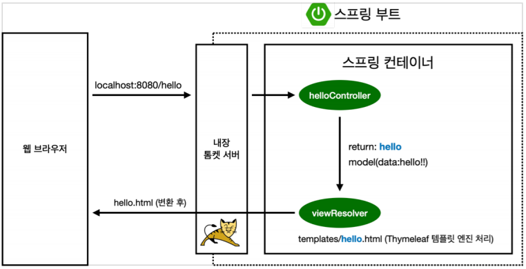

# 라이브러리 살펴보기
Gradle 의존관계가 있는 라이브러리를 함께 다운로드 한다. 

* 스프링 부트 라이브러리
    - spring-boot-starter-web
        + spring-boot-starter-tomcat : 톰켓 (웹서버)
        + spring-webmvc : 스프링 웹 MVC
    - spring-boot-starter-thymeleaf:타임리프 템플릿 엔진(View)
    - spring-boot-starter(공통): 스프링부트 + 스프링코어 + 로깅
        + spring-boot
            + spring-core
        + spring-boot-starter-logging
            + logback, slf4j


* 테스트 라이브러리
    - spring-boot-starter-test
        + junit : 테스트 프레임워크
        + mockito : 목 라이브러리
        + assertj : 테스트 코드를 좀 더 편한게 작성하게 도와주는 라이브러리
        + spring-test : 스프링 통합 테스트 지원

## View 환경설정
* Welcome, Page 만들기
    - resource/static/index.html
    - static : 정적파일
  ```html
  <!DOCTYPE HTML>
  <html>
  <head>
    <title>Hello</title>
    <meta http-equiv="Content-Type" content="text/html; charset=UTF-8" />
  </head>
  <body>
   Hello
  <a href="/hello">hello</a>
  </body>
  </html>
  ```
    - 스프링 부트가 제공하는 Welcome Page 기능
        + static/index.html 을 올려두면 Welcome page 기능을 제공한다
        + https://docs.spring.io/spring-boot/docs/2.3.1.RELEASE/reference/html/spring-boot-features.html#boot-features-spring-mvc-welcome-page

    - thymeleaf 템플릿 엔진
        + thymeleaf 공식 사이트: https://www.thymeleaf.org/
        + 스프링 공식 튜토리얼: https://spring.io/guides/gs/serving-web-content/
        + 스프링부트 메뉴얼: https://docs.spring.io/spring-boot/docs/2.3.1.RELEASE/reference/html/spring-boot-features.html#boot-features-spring-mvc-template-engines

  ```java
  @Controller
  public class HelloController {
  
    @GetMapping("hello")
    public String hello(Model model) {
        model.addAttribute("data", "hello!!");
        return "hello";
    }
  }
  ```
    - resources/templates/hello.html
  ```html
  <!DOCTYPE HTML>
  <html xmlns:th="http://www.thymeleaf.ofg">
  <head>
      <title>Hello</title>
      <meta http-equiv="Content-Type" content="text/html; charset=UTF-8"/>
  </head>
  
  <body>
  <p th:text="'안녕하세요. ' + ${data}">안녕하세요. 손님</p>
  </body>
  </html>
  ```

    - thymeleaf 템플릿엔진 동작 확인
        + 실행 : http://localhost:8080/hello
        + **동작환경 그림**
          

        + 컨트롤러에서 리턴 값으로 문자를 반환하면 viewResolver가 화면을 찾아서 처리한다.
            + 스프링 부트 템플릿 엔진 기본 viewName 매핑
            + resource:templates/ + {ViewName} + .html
  > 참고 spring-boot-devtools 라이브러리를 추가하면, html 파일을 컴파일만 해주면 서버 재시작 없이 View 파일 변경이 가능하다.

* 빌드하고 실행하기
    - 콘솔로 이동
        + gradlew.bat 실행
        + 명령 프롬프트에서 gradlew 하고 하고 엔터침
        + gradlew build
        + 폴더 목록 확인 dir
    