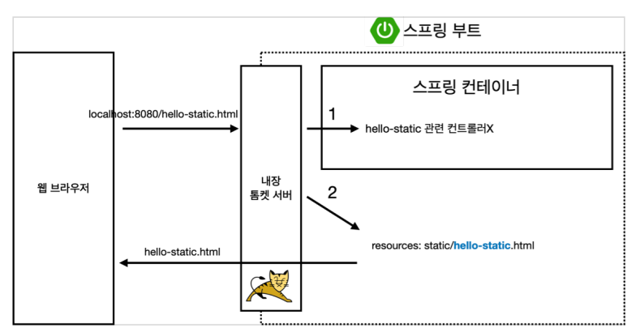
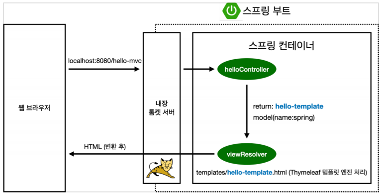
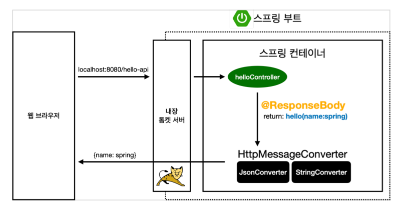

# 스프링 웹 개발 기초

## 정적 컨텐츠

* 스프링 부트 정적 컨텐츠 기능
* https://docs.spring.io/spring-boot/docs/2.3.1.RELEASE/reference/html/spring-boot-features.html#boot-features-spring-mvc-static-content

> resource/static/hello-static.html
```html
<!DOCTYPE HTML>
<html>
<head>
    <title>static content</title>
    <meta http-equiv="Content-Type" content="text/html; charset=UTF-8"/>
</head>

<body>
정적 컨텐츠 입니다.
</body>
</html>
```
* 실행
    - http://localhost:8080/hello-static.html

* 정적 컨텐츠 이미지
  

## MVC와 템플릿 엔진

* MVC : Model, View, Controller

    - **Controller**
  ```java
  @Controller
  public class HelloController {
    @GetMapping("hello-mvc")
    public String helloMvc(@RequestParam("name") String name, Model model) {
        model.addAttribute("name", name);
        return "hello-template";
    }
  }
  ```
    - **View**
  > resources/template/hello-template.html
  ```html
  <html xmlns:th="http://www.thymeleaf.org">
  <body>
  <p th:text="'hello ' + ${name}">hello! empty</p>
  </body>
  </html>
  ```
    - **실행**
        + http://localhost:8080/hello-mvc?name=spring

    - **MVC,템플릿 엔진 이미지**
      

## API
* **ResponsBody 문자반환**
  ```java
  @Controller
  public class HelloController {
    @GetMapping("hello-string")
    @ResponseBody
    public String helloString(@RequestParam("name") String name) {
        return "hello " + name;
    }
  }
  ```
    - @ResponseBody를 사용하면 뷰 리졸버(ViewResolver)를 사용하지 않음
    - 대신에 HTTP의 BODY에 문자 내용을 직접 반환(HTML BODY TAG를 말하는 것이 아님)

* 실행
    - http://localhost:8080/hello-spring?name=spring

* @ResponseBody 객체 반환
  ```java
  @Controller
  public class HelloController {
    @GetMapping("hello-api")
    @ResponseBody
    public Hello helloApi(@RequestParam("name") String name) {
        Hello hello = new Hello();
        hello.setName(name);
        return hello;
    }
    static class Hello {
        private String name;
        public String getName() {
            return name;
        }
        public void setName(String name) {
            this.name = name;
        }
    }
  }
  ```
    - @ResponseBody를 사용하고, 객체를 반환하면 객체가 JSON으로 변환됨

* 실행
    - http://localhost:8080/hello-api?name=spring

* **ResponseBody 사용 원리**
  

    - @ResponsBody를 사용
        + HTTP의 BODY 문자 내용을 직접 반환
        + viewResolver 대신에 HttpMessageConverter가 동작
        + 기본 문자처리 : StringHttpMessageConverter
        + 기본 객체처리 : MappingJackson2HttpMessageConverter
        + byte 처리 등등 기타 여러 HttpMessageConverter가 기본으로 등록되어 있음

  > 참고 : 클라이언트의 HTTp Accept헤더와 서버의 컨트롤러 반환 타입 정보 둘을 조합해서
  HttpMessageConverter가 선택된다.