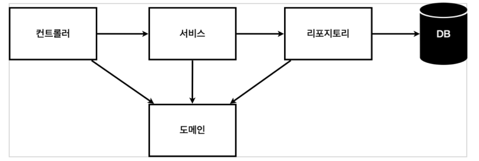
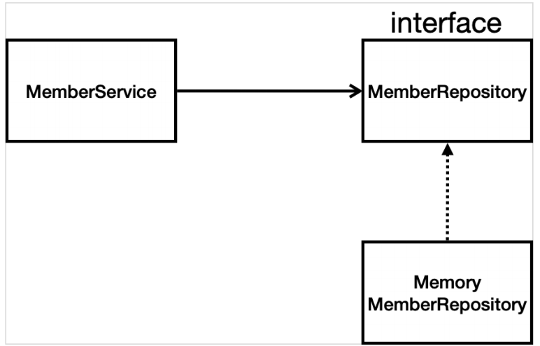

# 비즈니스 요구사항 정리
* 데이터 : 회원ID, 이름
* 기능 : 회원 등록, 조회
* 아직 데이터 저장소가 선정되지 않음 ( 가상의 시나리오 )


**일반적인 웹 애플리케이션 계층 구조**



- 컨트롤러 : 웹 MVC의 컨트롤러 역할
- 서비스 : 핵심 비즈니스 로직 구현
- 리포지토리 : 데이터베이스에 접근, 도메인 객체를 DB에 저장하고 관리
- 도메인 : 비즈니스 도메인 객체, 예) 회원,주문,쿠폰 등등 주로 데이터베이스에 저장하고 관리됨

**클래스 의존관계**



- 아직 데이터 저장소가 선정되지 않아서, 우선 인터페이스로 구현 클래스를 변경할 수 있도록 설계
- 데이터 저장소는 RDB, NoSQL 등등 다양한 저장소를 고민중인 상황으로 가정
- 개발을 진행하기 위해서 초기 개발 단계에서는 구현체로 가벼운 메모리 기반의 데이터 저장소 사용

## 회원 도메인과 리포지토리 만들기
**회원객체**
  ```java
  public class Member {
  String name;
  long id;

  public String getName() {
    return name;
  }

  public void setName(String name) {
    this.name = name;
  }

  public long getId() {
    return id;
  }

  public void setId(long id) {
    this.id = id;
  }
}
  ```

**회원 리포지토리 인터페이스**
  ```java
public interface MemberRepository {
    Member save(Member member);
    // Optional
    Optional<Member> findById(Long id);
    Optional<Member> findByName(String name);
    List<Member> findAll();
}
  ```
* Optional Class
    - Method Return (null || x) : Exception
    - 예외 방지용으로 사용할 수 있으며 Null 처리등을 할 수 있음.

* Interface
    - 하위클래스에서 특정 메서드만 사용하도록 강제
    - 클래스들간의 의존성 감소(decoupling)

**회원 리포지토리 메모리 구현체**

  ```java
  public class MemoryMemberRepository implements MemberRepository {


  private static Map<Long, Member> store = new HashMap<>();
  private static long sequence = 0L;


  @Override
  public Member save(Member member) {
    member.setId(++sequence);
    store.put(member.getId(), member);
    return member;
  }

  @Override
  public Optional<Member> findById(Long id) {
    return Optional.ofNullable(store.get(id)); // NUll 이여도 반환됨 Client 에서 처리
  }

  @Override
  public Optional<Member> findByName(String name) {
    return store.values().stream()
            .filter(member -> member.getName().equals(name))
            .findAny();
  }

  @Override
  public List<Member> findAll() {
    return new ArrayList<>(store.values());
  }

  public void clearStore(){
    store.clear();
  }
}
  ```
* 인터페이스 클래스
    - save
    - findById
    - findByName
    - findAll
    - 위 4개의 메소드를 구현하는 클래스

* Map 사용
    - 데이터와 데이터에 해당되는 이름(Key) 쌍으로 저장된다.(Key/Value 쌍)
    - Key 이용해서 Value 얻는다. (검색속도가 빠름)

* Optional.ofNullable
    - Null 이여도 반환되며 -> Client 에서 처리하는 식으로 넘기는 형태

* lambda 사용
    - 객체가 아닌 기능적인 코드에 집중하자.
    - 간결한 표현식
    - 하나의 메서드를 가진 인터페이스 사용시 일반적으로 람다식이 사용된다.

* Stream
    - Collection 저장된 데이터를 중간처리 최종처리를 할 수 있다.
        + 중간처리
            + 중복제거, 정렬 ==> Map
        + 최종처리
            + Sum, Max, Min, Count ==> Reduce