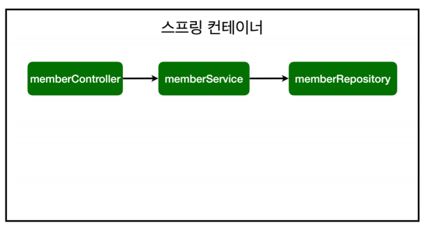

# Spring Bean Dependency Injection

* 컴포넌트 스캔과 자동 의존관계 설정
* 자바 코드로 직접 스프링 빈 등록하기

## 컴포넌트 스캔과 자동 의존관계 설정
회원 컨트롤러가 회원서비스와 회원 리포지토리를 사용할 수 있게 의존관계를 준비하자.

**회원 컨트롤러에 의존관계 추가**
```java
@Controller
public class MemberController {
 
    private final MemberService memberService;
 
    @Autowired
 
    public MemberController(MemberService memberService) {
 
        this.memberService = memberService;
 
    }
}
```
* 생성자에 @Autowired가 있으면 스프링이 연관된 객체를 스프링 컨테이너에서 찾아서 넣어준다. 이렇게 객체 의존관계를 외부에서
  넣어주는 것을 DI(Dependency Injection), 의존성 주입이라고 한다.

* 이전 테스트에서는 개발자가 직접 주입했고, 여기서는 @Autowired에 의해 스프링이 주입해준다.

**오류발생**
> Consider defining a bean of type 'hello.hellospring.service.MemberService' in
your configuration.

* MemberService가 스프링 빈으로 등록되어 있지 않다.


> 참고 : helloController는 스프링이 제공하는 컨트롤이여서 스프링 빈으로 자동 등록된다.
>
> @Controller가 있으면 자동 등록됨.

## 컴포넌트 스캔 원리

* @Component 애노테이션이 있으면 스프링 빈으로 자동 등록된다.
* @Controller 컨트롤러가 스프링 빈으로 자동 등록된 이유도 컴포넌트 스캔 때문이다.

* @Component를 포함한 다음 에노테이션도 스프링 빈으로 자동 등록된다.
    - @Controller
    - @Service
    - @Repository

**회원 서비스 스프링 빈 등록**
```java
@Service
public class MemberService {
 
    private final MemberRepository memberRepository;
 
    @Autowired
    public MemberService(MemberRepository memberRepository) {
        this.memberRepository = memberRepository;
    }
}

```
> 참고 : 생성자에 @Autowired 사용하면 객체 생성 시점에 스프링 컨테이너에서 해당 스프링 빈을 찾아서 주입한다.
>
> 생성자가 1개만 있으면 @Autowired는 생략할 수 있다.

**회원 리포지토리 스프링 빈 등록**
```java
@Repository
public class MemoryMemberRepository implements MemberRepository {}
```

스프링빈 등록이미지



* memberService, memberRepository -> spring container -> spring bean

> 참고 : 스프링은 스프링 컨테이너에 스프링 빈을 등록할때, 기본으로 싱글톤으로 등록한다.(유일하게 하나만 등록해서 공유한다)
>
> 따라서 같은 스프링 빈이면 모두 같은 인스턴스다. 설정으로 싱글톤이 아니게 설정할 수 있지만, 특별한 경우를 제외하면 대부분 싱글톤을 사용한다.

## 자바코드로 직접 스프링 빈 등록하기


* 회원서비스와 회원 리포지토리의 @Service, @Repository, @Autowired 애노테이션을 제거하고 진행한다.

```java
@Configuration
public class SpringConfig {

    @Bean
    public MemberService memberService(){
        return new MemberService(memberRepository());
    }
    @Bean
    public MemberRepository memberRepository(){
        return new MemoryMemberRepository();
    }
}
```

**여기서 향후 메모리 리포지토리를 다른 리포지토리로 변경할 예정이므로, 컴포넌트 스캔 방식 대신에 자바 코드로 스프링 빈을 설정하겠다.**

> 참고 : XML로 설정하는 방식도 있지만 최근에는 잘 사용하지 않으므로 생략한다.

> 참고 : DI에는 필드주입, setter주입, 생성자 주입 총 3가지 방식이 있다.
>
> 의존관계가 실행중에 동적으로 변하는 경우는 거의 없으므로 생성자 주입을 권장한다.

> 참고 : 실무에서는 주로 정형화된 컨트롤러, 서비스, 리포지토리 같은 코드는 컴포넌트 스캔을 사용한다.
>
> 그리고 정형화 되지 않거나, 상황에 따라 구현 클래스를 변경해야 하면 설정을 통해 스프링 빈으로 등록한다.

> 주의 : @Autowired를 통한 DI는 HelloController, memberService등과 같이 스프링이 관리하는 객체에서만 존재한다.
>
> 스프링 빈으로 등록하지 않고 내가 직접 생성한 객체에서는 동작하지 않는다.

