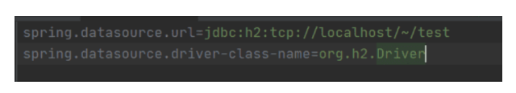
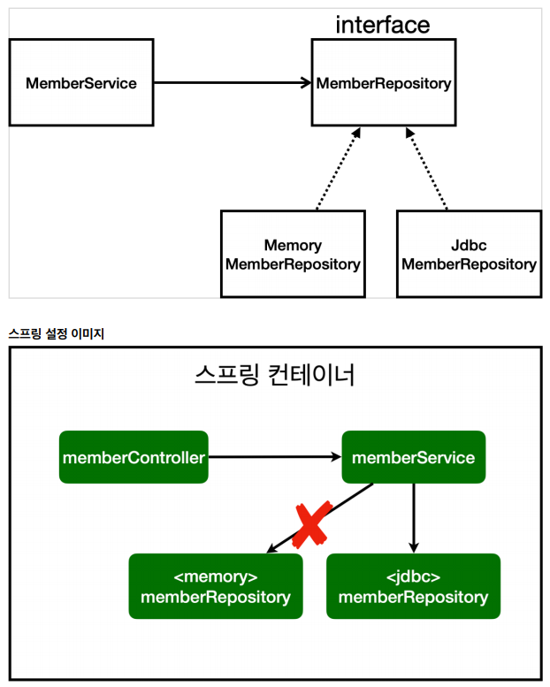

# Spring DB 접근 기술 

## H2 데이터베이스 설치
개발이나 테스트 용도로 가볍고 편리한 DB, 웹 화면 제공

* https://www.h2database.com
* 다운로드 및 설치
* h2 데이터베이스 버전은 스프링 부트 버전에 맞춘다.
* 권한주기(Mac) : chmod 755 h2.sh
* 실행 : ./h2.sh
* 데이터베이스 파일 생성방법
    - jdbc:h2:~/test (최초한번)
    - ~/test.mv.db 파일생성 확인
    - 이후부터는 jdbc:h2:tcp://localhost/~/test 이렇게 접속

**테이블 생성하기**

테이블 관리를 위해 프로젝트 루트에 sql/ddl.sql 파일을 생성
```mysql
drop table if exists member CASCADE;
create table member
(
 id bigint generated by default as identity,
 name varchar(255),
 primary key (id)
);
```

H2 데이터베이스에 접근해서 member 테이블 생성

## 순수 Jdbc
환경 설정

**build.gradle 파일에 jdbc,h2 데이터베이스 관련 라이브러리 추가**

```java
implementation 'org.springframework.boot:spring-boot-starter-jdbc'
runtimeOnly 'com.h2database:h2'
```

**스프링 부트 데이터베이스 연결 설정 추가**

resource/application.properties

```java
spring.datasource.url=jdbc:h2:tcp://localhost/~/test
spring.datasource.driver-class-name=org.h2.Driver
spring.datasource.username=sa
```

> **주의!**: 스프링부트 2.4부터는 spring.datasource.username=sa를 꼭 추가해주어야 한다. 그렇지
>
> 않으면 Worng user name or password 오류가 발생한다. 참고로 다음과 같이 마지막에 공백이 들어가면 같은 오류가 발생한다.
>
> spring.datasource.username=sa <- 공백주의, 공백은 모두 제거해야 한다.

> **참고**: 인텔리J 컴뮤니티(무로)버전의 경우 application.properties 파일의 왼쪽이 다음 그림과 같이 회색으로 나온다.
>
> 엔터프라이즈(유로)버전에서 제공하는 스프링의 소스 코드를 연결해주는 편의 기능이 빠진 것인데, 실제 동작하는데는 아무런 문제가 없다.



## Jdbc 리포지토리 구현

주의! 이렇게 JDBC API로 직접 코딩하는 것은 20년전 이야기이다. 따라서 고대 개발자들이 이렇게
고생하고 살았구나 생각하고, 정신건강을 위해 참고만 하고 넘어가자.

**Jdbc 회원 리포지토리**
```java
public class JdbcMemberRepository implements MemberRepository {

    private final DataSource dataSource;

    public JdbcMemberRepository(DataSource dataSource) {
        this.dataSource = dataSource;
    }

    @Override
    public Member save(Member member) {

        String sql = "insert into member(name) values(?)";

        Connection conn = null;
        PreparedStatement pstmt = null;
        ResultSet rs = null;

        try {
            conn = getConnection();
            pstmt = conn.prepareStatement(sql,
                    Statement.RETURN_GENERATED_KEYS);
            pstmt.setString(1, member.getName());

            pstmt.executeUpdate();
            rs = pstmt.getGeneratedKeys();

            if (rs.next()) {
                member.setId(rs.getLong(1));
            } else {
                throw new SQLException("id 조회 실패");
            }
            return member;
        } catch (Exception e) {
            throw new IllegalStateException(e);
        } finally {
            close(conn, pstmt, rs);
        }
        
    }
    @Override
    public Optional<Member> findById(Long id) {
        String sql = "select * from member where id = ?";
        Connection conn = null;
        PreparedStatement pstmt = null;
        ResultSet rs = null;
        try {
            conn = getConnection();
            pstmt = conn.prepareStatement(sql);
            pstmt.setLong(1, id);
            rs = pstmt.executeQuery();
            if(rs.next()) {
                Member member = new Member();
                member.setId(rs.getLong("id"));
                member.setName(rs.getString("name"));
                return Optional.of(member);
            } else {
                return Optional.empty();
            }
        } catch (Exception e) {
            throw new IllegalStateException(e);
        } finally {
            close(conn, pstmt, rs);
        }
    }
    @Override
    public List<Member> findAll() {
        String sql = "select * from member";
        Connection conn = null;
        PreparedStatement pstmt = null;
        ResultSet rs = null;
        try {
            conn = getConnection();
            pstmt = conn.prepareStatement(sql);
            rs = pstmt.executeQuery();
            List<Member> members = new ArrayList<>();
            while(rs.next()) {
                Member member = new Member();
                member.setId(rs.getLong("id"));
                member.setName(rs.getString("name"));
                members.add(member);
            }
            return members;
        } catch (Exception e) {
            throw new IllegalStateException(e);
        } finally {
            close(conn, pstmt, rs);
        }
    }
    @Override
    public Optional<Member> findByName(String name) {
        String sql = "select * from member where name = ?";
        Connection conn = null;
        PreparedStatement pstmt = null;
        ResultSet rs = null;
        try {
            conn = getConnection();
            pstmt = conn.prepareStatement(sql);
            pstmt.setString(1, name);
            rs = pstmt.executeQuery();
            if(rs.next()) {
                Member member = new Member();
                member.setId(rs.getLong("id"));
                member.setName(rs.getString("name"));
                return Optional.of(member);
            }
            return Optional.empty();
        } catch (Exception e) {
            throw new IllegalStateException(e);
        } finally {
            close(conn, pstmt, rs);
        }
    }
    private Connection getConnection() {
        return DataSourceUtils.getConnection(dataSource);
    }
    private void close(Connection conn, PreparedStatement pstmt, ResultSet rs)
    {
        try {
            if (rs != null) {
                rs.close();
            }
        } catch (SQLException e) {
            e.printStackTrace();
        }
        try {
            if (pstmt != null) {
                pstmt.close();
            }
        } catch (SQLException e) {
            e.printStackTrace();
        }
        try {
            if (conn != null) {
                close(conn);
            }
        } catch (SQLException e) {
            e.printStackTrace();
        }
    }
    private void close(Connection conn) throws SQLException {
        DataSourceUtils.releaseConnection(conn, dataSource);
    }
}
```
* DataSource는 데이터베이스 커넥션을 획득할 때 사용하는 객체다. 스프링 부트는 데이터베이스 커넥션
  정보를 바탕으로 DataSource를 생성하고 스프링 빈으로 만들어둔다. 그래서 DI를 받을 수 있다.

**구현클래스 추가 이미지**


* 개방-폐쇄 원칙(OCP, Open-Closed Principle)
    - 확장에는 열려있고, 수정, 변경에는 닫혀있다.
* 스프링 DI(Dependencies Injection)을 사용하면 기존 코드를 전혀 손대지 않고, 설정만으로 구현
  클래스를 변경할 수 있다.
* 회원을 등록하고 DB에 결과가 잘 입력되는지 확인하자.
* 데이터를 DB에 저장하므로 스프링 서버를 다시 실행에도 데이터가 안전하게 저장된다.

## 스프링 통합 테스트

스프링 컨테이너와 DB까지 연결한 통합 테스트를 진행해보자.

**회원 서비스 스프링 통합 테스트**
```java
@SpringBootTest
@Transactional // 데이터 트랜잭션 해주고 그다음 롤백 해줌
class MemberServiceIntegrationTest {

    @Autowired MemberService memberService;
    @Autowired MemberRepository memberRepository;

    @Test
    void 회원가입() {
        //given
        Member member = new Member();
        member.setName("TEST");

        //when
        Long saveId = memberService.join(member);

        //then
        memberService.findOne(saveId).get();
        Member findMember = memberService.findOne(saveId).get();
        assertThat(member.getName()).isEqualTo(findMember.getName());
    }

    @Test
    public void 중복_회원_예외(){
        //given
        Member member1 = new Member();
        member1.setName("TEST");

        Member member2 = new Member();
        member2.setName("TEST");

        //when
        memberService.join(member1);
        IllegalStateException e = assertThrows(IllegalStateException.class, () -> memberService.join(member2));
        assertThat(e.getMessage()).isEqualTo("이미 존재하는 회원입니다.");
        //then
    }
    @Test
    void findMembers() {
    }

    @Test
    void findOne() {
    }
}
```

* @SpringBootTest: 스프링 컨테이너와 테스트를 함께 실행한다.
* @Transactional: 테스트 케이스에 이 애노테이션이 있으면, 테스트 시작 전에 트랜잭션을 시작하고,
  테스트 완료 후에 항상 롤백한다. 이렇게 하면 DB에 데이터가 남지 않으므로 다음 테스트에 영향을 주지 않는다.

## 스프링 JdbcTemplate
* 순수 Jdbc와 동일한 환경설정을 하면 된다.
* 스프링 JdbcTemplate과 Mybatis 같은 라이브러리는 JDBC API에서 본 반복 코드를 대부분 제거해준다.
  하지만 SQL은 직접 작성해야 한다.

**스프링 JdbcTemplate 회원 리포지토리**
```java
public class JdbcTemplateMemberRepository implements MemberRepository{

    private final JdbcTemplate jdbcTemplate;

    public JdbcTemplateMemberRepository(DataSource dataSource) {
        this.jdbcTemplate = new JdbcTemplate(dataSource);
    }

    @Override
    public Member save(Member member) {
        SimpleJdbcInsert jdbcInsert = new SimpleJdbcInsert(jdbcTemplate);
        jdbcInsert.withTableName("member").usingGeneratedKeyColumns("id");

        Map<String, Object> parameters = new HashMap<>();
        parameters.put("name", member.getName());

        Number key = jdbcInsert.executeAndReturnKey(new MapSqlParameterSource(parameters));
        member.setId(key.longValue());
        return member;
    }

    @Override
    public Optional<Member> findById(Long id) {
        List<Member> result = jdbcTemplate.query("select * from member where id =?", memberRowMapper(), id);
        return result.stream().findAny();
    }

    @Override
    public Optional<Member> findByName(String name) {
        List<Member> result = jdbcTemplate.query("select * from member where name =?", memberRowMapper(), name);
        return result.stream().findAny();
    }

    @Override
    public List<Member> findAll() {
        return jdbcTemplate.query("select * from member", memberRowMapper());
    }

    private RowMapper<Member> memberRowMapper(){
        return (rs, rowNum) -> {
            Member member = new Member();
            member.setId(rs.getLong("id"));
            member.setName(rs.getString("name"));
            return member;
        };
    }

}
```

**JdbcTemplate을 사용하도록 스프링 설정 변경**
```java
@Bean
    public MemberRepository memberRepository(){
//        return new MemoryMemberRepository();
//        return new JdbcMemberRepository(dataSource);

        return new JdbcTemplateMemberRepository(dataSource);
    }
```

