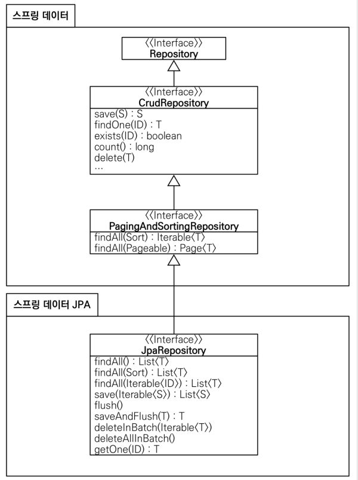

# JPA
* JPA는 기존의 반복 코드는 물론이고, 기본적인 SQL도 JPA가 직접 만들어서 실행해준다.
* JPA를 사용하면, SQL과 데이터 중심의 설계에서 객체 중심의 설계로 패러다임을 바꿀 수 있다.
* JPA를 사용하면 개발 생산성을 크게 높일 수 있다.

#### build.gradle 파일에 JPA, h2 데이터베이스 관련 라이브러리 추가
```java
dependencies {
implementation 'org.springframework.boot:spring-boot-starter-thymeleaf'
implementation 'org.springframework.boot:spring-boot-starter-web'
//implementation 'org.springframework.boot:spring-boot-starter-jdbc'
implementation 'org.springframework.boot:spring-boot-starter-data-jpa'
runtimeOnly 'com.h2database:h2'
testImplementation('org.springframework.boot:spring-boot-starter-test') {
exclude group: 'org.junit.vintage', module: 'junit-vintage-engine'
}
}
```

* spring-boot-starter-data-jpa는 내부에 jdbc 관련 라이브러리를 포함한다. 따라서 jdbc는 제거해도 된다.

#### 스프링 부트에 JPA 설정 추가
* resource/application.properties

```java
spring.datasource.url=jdbc:h2:tcp://localhost/~/test
spring.datasource.driver-class-name=org.h2.Driver
spring.datasource.username=sa
spring.jpa.show-sql=true
spring.jpa.hibernate.ddl-auto=none
```

* show-sql : JPA가 생성하는 SQL을 출력한다.
* ddl-auto : JPA는 테이블을 자동으로 생성하는 기능을 제공하는데 none을 사용하면 해당 기능을 끈다.
    - create를 사용하면 엔티티 정보를 바탕으로 테이블도 직접 생성해준다.

#### JPA 엔티티 매핑
```java
@Entity
public class Member {

    @Id @GeneratedValue(strategy = GenerationType.IDENTITY)
    long id;

    String name;

    // git

    public String getName() {
        return name;
    }

    public void setName(String name) {
        this.name = name;
    }

    public long getId() {
        return id;
    }

    public void setId(long id) {
        this.id = id;
    }
}
```

#### JPA 회원 리포지토리
```java
public class JpaMemberRepository implements MemberRepository{

    //JPA 쓰려면 EntityManager 써야함.
    private final EntityManager em;

    public JpaMemberRepository(EntityManager em) {
        this.em = em;
    }

    @Override
    public Member save(Member member) {
        em.persist(member);
        return member;
    }

    @Override
    public Optional<Member> findById(Long id) {
        Member member = em.find(Member.class, id);
        return Optional.ofNullable(member);
    }

    @Override
    public Optional<Member> findByName(String name) {
        List<Member> result = em.createQuery("select m from Member m where m.name = :name", Member.class)
                .setParameter("name", name)
                .getResultList();
        return result.stream().findAny();
    }

    @Override
    public List<Member> findAll() {
        // 1라인 ctrl + alt + n
        return em.createQuery("select m from Member m", Member.class).getResultList();
    }
}
```

#### 서비스 계층에 트랜잭션 추가
```java
@Transactional
public class MemberService {}
```
* org.springframework.transaction.annotation.Transactional을 사용하자.
* 스프링은 해당 클래스의 메서드를 실행할 때 트랜젝션을 시작하고, 메서드가 정상 종료되면 트랜잭션을 커밋한다. 만약 런타임 예외가 발생하면 롤백한다.
* **JPA를 통한 모든 데이터 변경은 트랜잭션 안에서 실행해야 한다.**

#### JPA를 사용하도록 스프링 설정 변경
```java
@Configuration
public class SpringConfig {
 private final DataSource dataSource;
 private final EntityManager em;
 public SpringConfig(DataSource dataSource, EntityManager em) {
 this.dataSource = dataSource;
 this.em = em;
 }
 @Bean
 public MemberService memberService() {
 return new MemberService(memberRepository());
 }
 @Bean
 public MemberRepository memberRepository() {
// return new MemoryMemberRepository();
// return new JdbcMemberRepository(dataSource);
// return new JdbcTemplateMemberRepository(dataSource);
 return new JpaMemberRepository(em);
 }
}
```

## 스프링 데이터 JPA
스프링 부트와 JPA만 사용해도 개발 생산성이 정말 많이 증가하고, 개발해야할 코드도 확연히 줄어듭니다.
여기에 스프링 데이터 JPA를 사용하면, 기존의 한계를 넘어 마치 마법처럼, 리포지토리에 구현 클래스 없이 인터페이스 만으로
개발을 완료할 수 있습니다. 그리고 반복 개발해온 기본 CRUD 기능도 스프링 데이터 JPA가 모두 제공합니다.

스프링 부트와 JPA라는 기반 위에, 스프링 데이터 JPA라는 환상적인 프레임워크를 더하면 개발이 정말 즐거워집니다.
지금까지 조금이라도 단순하고 반복이라 생각했던 개발 코드들이 확연하게 줄어듭니다.
따라서 개발자는 핵심 비즈니스 로직을 개발하는데, 집중할 수 있습니다.
실무에서 관계형 데이터베이스를 사용한다면 스프링 데이터 JPA는 이제 선택이 아니라 필수입니다.

> 주의 : **스프링 데이터 JPA는 JPA를 편리하게 사용하도록 도와주는 기술입니다. 따라서 JPA를 먼저
>
> 학습한 후에 스프링 데이터 JPA를 학습해야 합니다.

#### 스프링 데이터 JPA 회원 리포지토리
```java
public interface SpringDataJpaMemberRepository extends JpaRepository<Member, Long>, MemberRepository {
    // select m from Member m where m.name = ?
    // 단순한 쿼리는 interface 만으로 끝난다!!!!! JPA 공부 필수 !!
    @Override
    Optional<Member> findByName(String name);
}
```
#### 스프링 데이터 JPA 회원 리포지토리를 사용하도록 스프링 설정 변경
```java
@Configuration
public class SpringConfig {

  private final MemberRepository memberRepository;

  @Autowired
  public SpringConfig(MemberRepository memberRepository) {
    this.memberRepository = memberRepository;
  }

  @Bean
  public MemberService memberService() {
    return new MemberService(memberRepository);
  }
}
```
* 스프링 데이터 JPA가 SpringDataJpaMemberRepository를 스프링 빈으로 자동 등록해준다.

#### 스프링 데이터 JPA 제공 클래스


**스프링 데이터 JPA 제공 기능**
* 인터페이스를 통한 기본적인 CRUD
* findByName(), findByEmail() 처럼 메서드 이름 만으로 조회 기능 제공
* 페이징 기능 자동 제공

> 참고: 실무에서는 JPA와 스프링 데이터 JPA를 기본으로 사용하고, 복잡한 동적 쿼리는 Querydsl이라는
>
> 라이브러리를 사용하면 된다. Querydsl을 사용하면 쿼리도 자바 코드로 안전하게 작성할 수 있고, 동적
>
> 쿼리도 편리하게 작성할 수 있다. 이 조합으로 해결하기 어려운 쿼리는 JPA가 제공하는 네이티브 쿼리를 사용하거나
>
> 앞서 학습한 스프링 JdbcTemplate를 사용하면 된다.